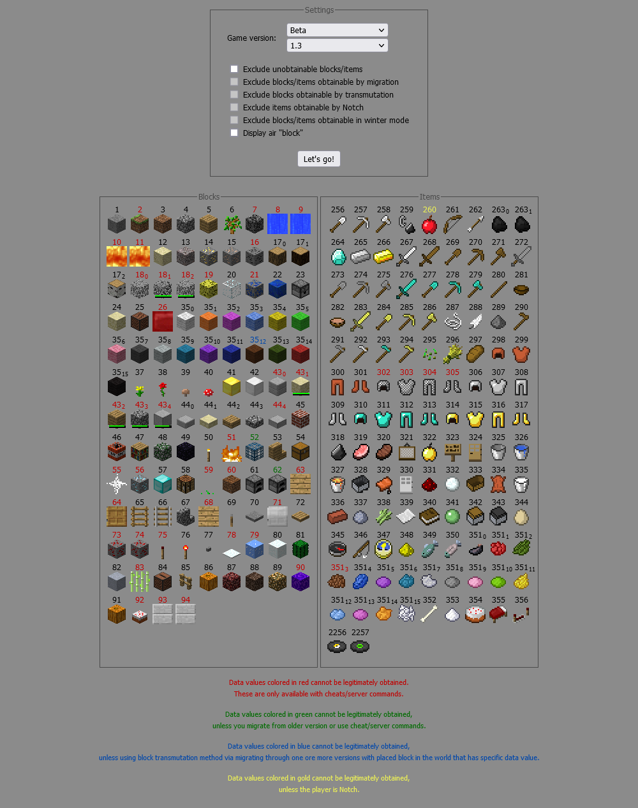

# Minecraft Legacy Companion

**Minecraft Legacy Companion** (or **MLC** for short) is a website designed to help you with various aspects of legacy **Minecraft** versions.

For now it can only be used to display block/items ID's (and their obtainability) in **Minecraft** Pre-Classic, Classic and Indev, but in the future it will be expanded up to newer versions (with varying level of support) and additional features.

If you want to see live version [go here](https://matriks404.github.io/mlc/).

Alternatively, for running locally go to the section [over there](#running-locally).

**NOT AN OFFICIAL MINECRAFT [PRODUCT/SERVICE/EVENT/etc.]. NOT APPROVED BY OR ASSOCIATED WITH MOJANG OR MICROSOFT**

## Screenshot

## Functionality

Following table shows current and planned functionality:

|                  | Pre-Classic | Classic | Indev | Infdev | Alpha | Beta | Final (pre-flattening[^1]) | Final (after-flattening[^2]) |
| :--------------: | :---------: | :-----: | :---: | :----: | :---: | :--: | :------------------------: | :--------------------------: |
|  **Block ID's**  |      ✔️      |    ✔️    | ✔️[^3] |   ❌    |   ❌   |  ❌   |             ❌              |              ❌               |
|  **Item ID's**   |      🚫      |    🚫    | ✔️[^3] |   ❌    |   ❌   |  ❌   |             ❌              |              ❌               |
|   **Mob ID'S**   |      ❓      |    ❓    |   ❓   |   ❓    |   ❓   |  ❓   |             ❌              |              ❌               |
| **Achievements** |      🚫      |    🚫    |   🚫   |   🚫    |   🚫   |  ❌   |             ❌              |              ❌               |

## Accessibility

* Website applies high contrast theme when applicable.

## Running locally

1. Either:
   * Download a zip with the repository files by clicking green **Code** button and then clicking **Download ZIP** (simplest);

   * or use `git clone` command (recommended) in your operating system's console (recommended), note that you might need to install [git](https://git-scm.com/) first.

     * After making sure you have git installed you just need to enter following command in your console: `git clone https://github.com/Matriks404/mlc.git`

2. Build stylesheet using Sass:
	* On Windows get Sass [here](https://github.com/sass/dart-sass/releases/latest), then [add it to to your PATH](https://katiek2.github.io/path-doc/) and using command line interpreter go to `scripts/` directory and execute `.\Build.Windows.bat`.

	* On Unix-like operating systems (e.g. Linux, any BSD or macOS) install Sass using your package manager and using terminal go to `scripts/` directory and execute `./Build.Unix.sh`.

3. Run a web server on your local machine (or somewhere else) using any server software you like to use with this project's `site/` directory as a target location.

     * On Windows you can use [PHP built-in web server](https://windows.php.net/download#php-8.3). Select appropriate version and install it. Alternatively use anything else, as it should work with any HTTP server.

       * If you use PHP built-in server you can run script in the `scripts/` directory called `Run.Windows.bat`, but before running make sure that paths to your `php` directory and mlc repository are correct, which you can do by editing the file in any text editor.

     * On Unix-like operating systems (e.g. Linux, any BSD or macOS) you can figure it out on your own.

4. Open `localhost:<port>` URL in your browser on local machine.

   * If you followed instructions for getting PHP installed on Windows, website is located at `localhost:8888`.

Website will also of course work for any device that is connected on your local network as long as you configured HTTP server properly and entered valid IP of your computer on other device's web browser (NOT `localhost`). If you use PHP built-in web server on Windows, this should work by default.

## Version importance

Functionality for versions will be added in waves by following priority:

1. **Versions <= Beta 1.7.3** - These are highest priority.
2. **Versions <= Release 1.7.10** - These are medium-high priority.
3. **Versions < Flattening (1.13 Snapshot 17w47a)** - These are low priority.
4. **Versions > Flattening (1.13 Snapshot 17w47a)** - These will probably not be supported at all, given project goal. There are better resources (like [Minecraft Wiki](https://minecraft.wiki)) for these. Contributions are welcome though, as long as they don't break or heavily change existing codebase.

## Licensing terms

All of the original content is licensed under **CC BY-NC-SA 3.0** (compatible with [minecraft.wiki](https://minecraft.wiki/w/Minecraft_Wiki:Copyrights)) license.

The design of the interface is based on the [this diagram](https://minecraft.wiki/images/archive/20110915061258%21DataValuesBeta.png?2d45e&format=original) and the licensing for it applies.

Additionally this project uses in-game rendered **Minecraft** assets which are copyrighted by **[Mojang Studios](https://mojang.com)**, the terms of use for these assets can be found [here](https://www.minecraft.net/en-us/usage-guidelines#terms-brand_guidelines).

[^1]: Applies to versions before Minecraft 1.13 snapshot 17w47a.

[^2]: Applies to versions after (and including) Minecraft 1.13 snapshot 17w47a.

[^3]: Minecraft Indev 0.31 versions: 20091231-2, 20100104 and 20100110 have unknown block renders and unknown block ID's.
